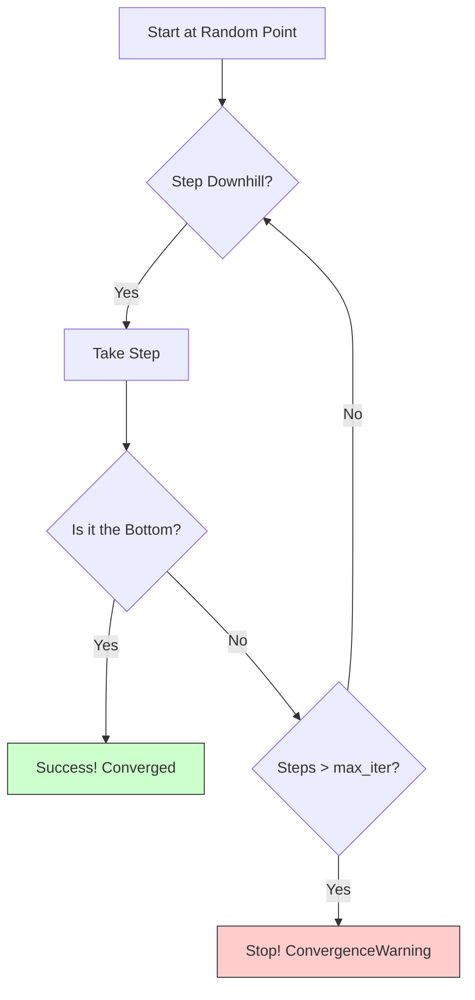
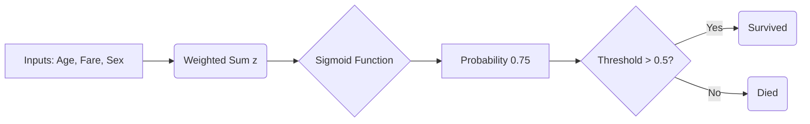
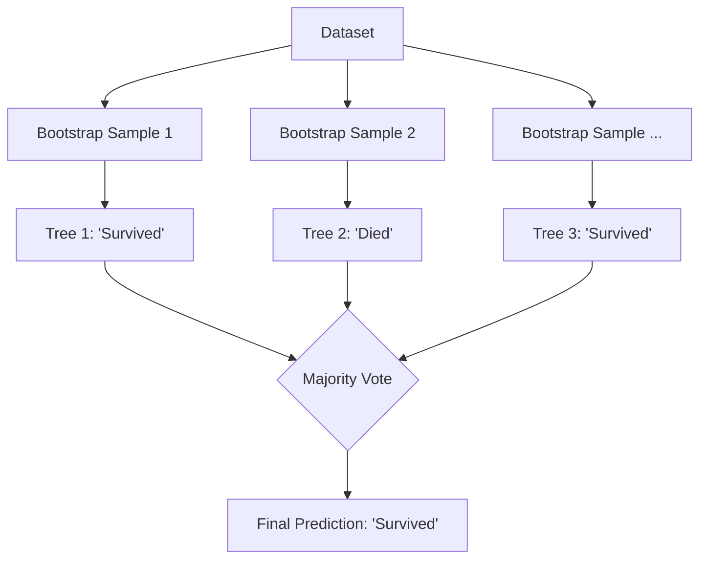
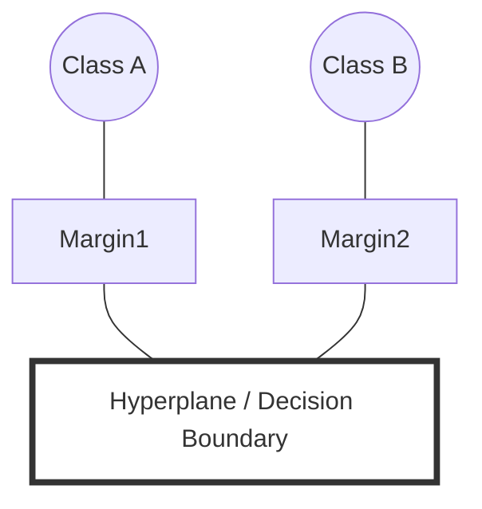

# Deep Dive: ML Models & Parameters / Глубокое погружение: ML модели и параметры

## 1. The `max_iter` Parameter: How to Choose? / Параметр `max_iter`: Как выбрать?

### 🇬🇧 English
**Visual Concept**: Imagine a blindfolded hiker trying to find the lowest point in a valley (Minimum Error). `max_iter` is the maximum number of steps they are allowed to take.

**Real-World Example**:
*   **Finance**: Optimizing portfolio weights where you need a precise solution within milliseconds.
*   **Robotics**: Inverse kinematics solvers where you need a solution before the robot moves to the next frame.

**How to determine the optimal value?**
It depends on the **complexity of the optimization surface**.
1.  **Scale Data first!** (StandardScaler). This smooths the terrain.
2.  **Increase `max_iter`**: `100` -> `1000` -> `5000`.

### 🇷🇺 Русский
**Визуализация**: Представьте туриста с завязанными глазами, который пытается найти самую низкую точку в долине (Минимальную ошибку). `max_iter` — это максимальное количество шагов, которое ему разрешено сделать.

**Пример из жизни**:
*   **Финансы**: Оптимизация портфеля акций, где нужно точное решение за миллисекунды.
*   **Робототехника**: Расчет движения робота, где решение нужно найти до следующего кадра.

---

## 2. Logistic Regression (Логистическая Регрессия)

### 🇬🇧 English
**Visual Concept**: Finding a linear boundary.

**Common Use Cases**:
*   **Credit Scoring**: Predicting if a user will default on a loan (Yes/No).
*   **Medical Diagnosis**: Healthy vs. Sick based on blood test results.
*   **Spam Detection**: Is this email Spam or Not Spam?

**Trend**: 
Still the **#1 industry standard** for baselines. It provides **interpretable coefficients** (e.g., "being male reduces odds by 50%"), which is crucial in banking and medicine where "black box" models are illegal.

### 🇷🇺 Русский
**Частые примеры**:
*   **Кредитный скоринг**: Вернет ли клиент кредит (Да/Нет).
*   **Медицина**: Здоров/Болен на основе анализов.
*   **Спам-фильтры**: Спам или не спам.

**Тренд**:
Остается **золотым стандартом** как базовая модель. Она дает **интерпретируемые коэффициенты** (например, "мужской пол снижает шансы на 50%"), что критически важно в банках и медицине, где "черные ящики" запрещены.

---

## 3. Random Forest (Случайный Лес)

### 🇬🇧 English
**Visual Concept**: Wisdom of the Crowds.

**Common Use Cases**:
*   **E-commerce Recommendation**: Predicting if a user will buy an item based on history.
*   **Fraud Detection**: Detecting anomaly transactions in real-time.
*   **Kinect/Gaming**: Real-time body pose estimation (used in Xbox Kinect original algorithms).

**Trend**:
It is the **"King of Tabular Data"**. For structured data (Excel-like tables), Kaggle competitions show that Gradient Boosting (XGBoost/CatBoost) and Random Forests still often outperform deep neural networks. They are "robust out of the box" and require less tuning.

### 🇷🇺 Русский
**Частые примеры**:
*   **Рекомендации**: Купит ли пользователь товар.
*   **Антифрод**: Поиск мошеннических транзакций.
*   **Геймдев**: Распознавание позы тела (использовалось в Xbox Kinect).

**Тренд**:
Это **"Король табличных данных"**. Для обычных таблиц (как в Excel) Random Forest и Градиентный Бустинг (XGBoost) все еще часто побеждают нейросети. Они работают "из коробки" и требуют меньше настройки.

---

## 4. Support Vector Machine / SVM (Метод Опорных Векторов)

### 🇬🇧 English
**Visual Concept**: Maximizing the "Street" width.

*Ideally, SVM creates the widest possible gap between the nearest dots of Class A and Class B.*

**Common Use Cases**:
*   **Text Classification**: Categorizing news articles into topics (Politics, Sports) - works well with high-dimensional sparse data.
*   **Bioinformatics**: Classifying gene expression data.
*   **Image Recognition (Legacy)**: Used for face detection before Deep Learning took over.

**Trend**:
**Declining popularity** for large datasets because it is slow ($O(n^2)$ complexity). However, it is still **excellent for small, complex datasets** with high dimensionality where neural networks would overfit.

### 🇷🇺 Русский
**Частые примеры**:
*   **Классификация текста**: Новости по рубрикам (Политика, Спорт).
*   **Биоинформатика**: Анализ генов.
*   **Распознавание образов**: Использовался для лиц до эры глубокого обучения.

**Тренд**:
**Популярность падает** на больших данных, так как он медленный. Но он все еще **незаменим для маленьких, сложных задач**, где нейросети просто запомнят данные (переобучатся).
